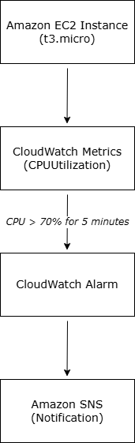
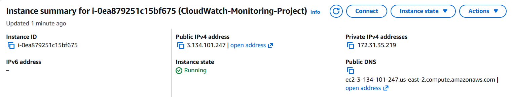
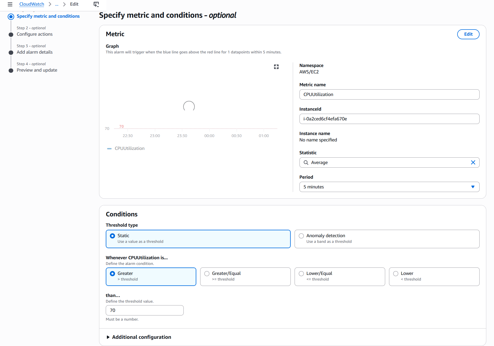
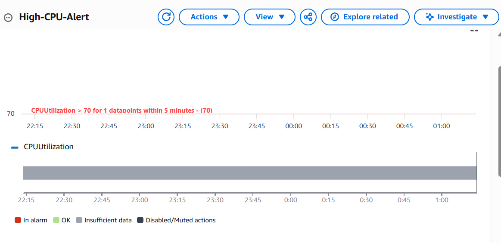

# Project 1: CloudWatch Monitoring & Alerting

## Project Overview
This project demonstrates a basic monitoring and alerting setup using Amazon CloudWatch.  
I launched an EC2 instance and configured CloudWatch to monitor CPU utilization and trigger an alarm when usage exceeds 70% for 5 minutes.

This type of setup is commonly used in Cloud Operations to proactively detect performance issues and notify the team.

## Architecture Diagram

## Technologies Used
- Amazon EC2 (t3.micro)
- Amazon CloudWatch (Metrics + Alarms)
- Amazon SNS (Notifications - optional)

## What I Built
- Launched a t3.micro EC2 instance in a public subnet
- Created a CloudWatch alarm that triggers when Average CPUUtilization > 70% for 5 minutes
- Configured an SNS topic for notifications (topic created for testing purposes)

## Screenshots

**1. EC2 Instance Running**

**2. CloudWatch Alarm Setup (CPU > 70%)**

**3. CloudWatch Alarm Graph**

## Key Learnings
- How to monitor EC2 performance metrics in real-time using CloudWatch
- Setting appropriate alarm thresholds and evaluation periods
- Understanding how alarms integrate with notifications via SNS
- Importance of proactive monitoring in a production Cloud Operations environment

## Notes
- The CloudWatch alarm was configured by selecting the specific EC2 instance's CPUUtilization metric using its Instance ID.
- An SNS topic was created for notifications (no subscribers added for this learning project).

## How This Relates to Cloud Ops
In a real Cloud Operations role, similar monitoring and alerting setups are used daily to maintain system reliability, detect issues early, and reduce mean time to resolution.

---

**Made as part of my journey toward a Cloud Operations Engineer role**  
AWS Certified Cloud Practitioner (CLF-C02) | April 2026