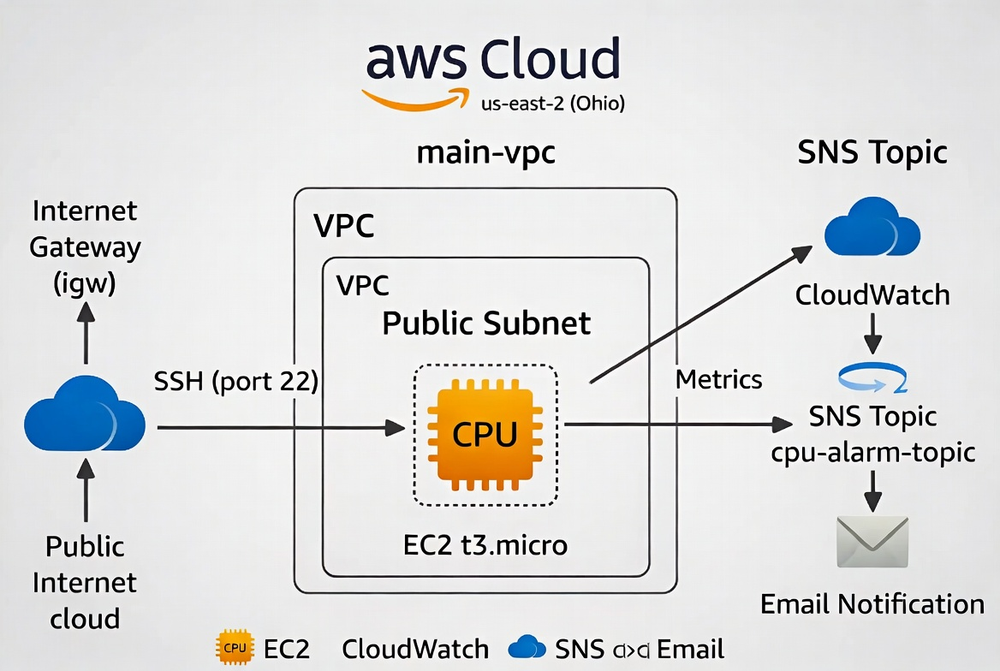
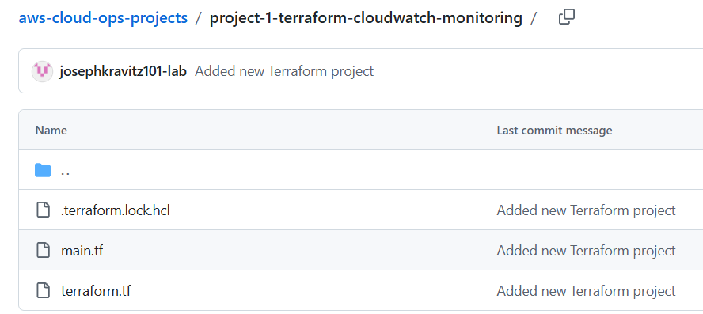
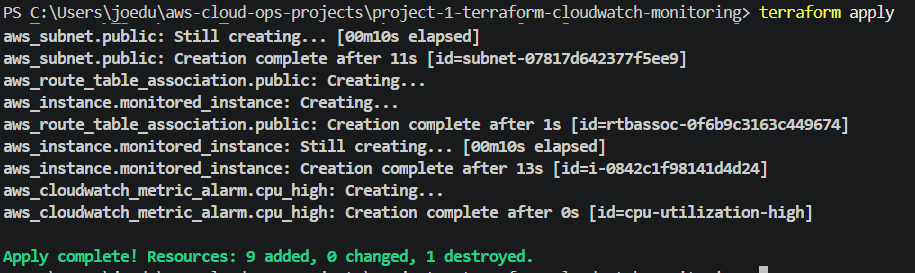
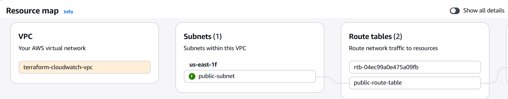
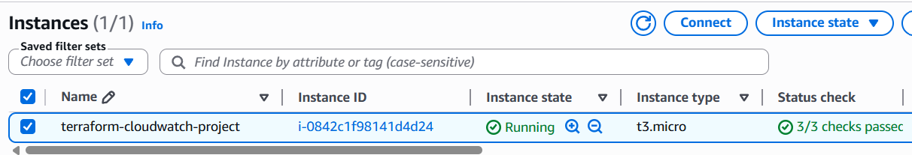
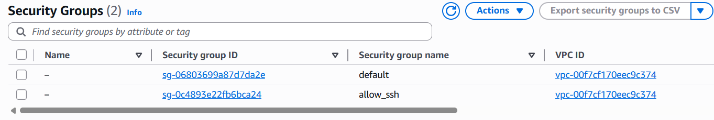
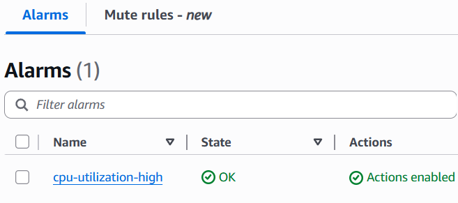
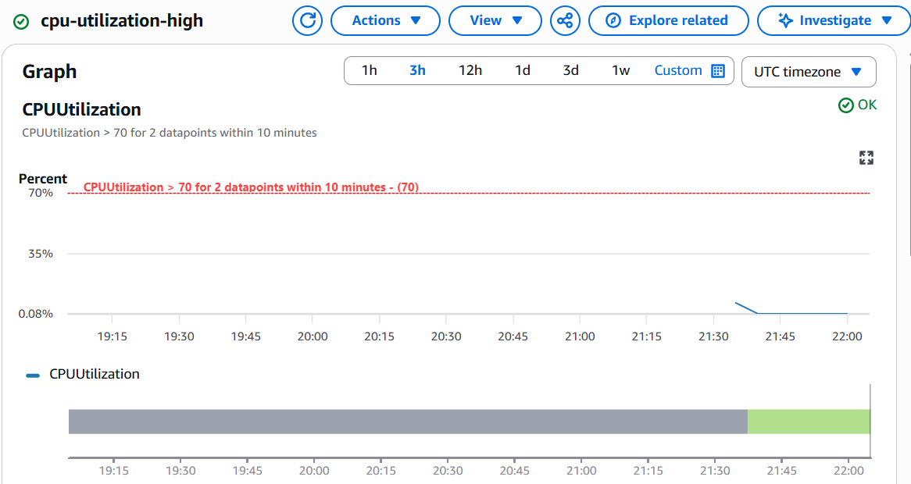
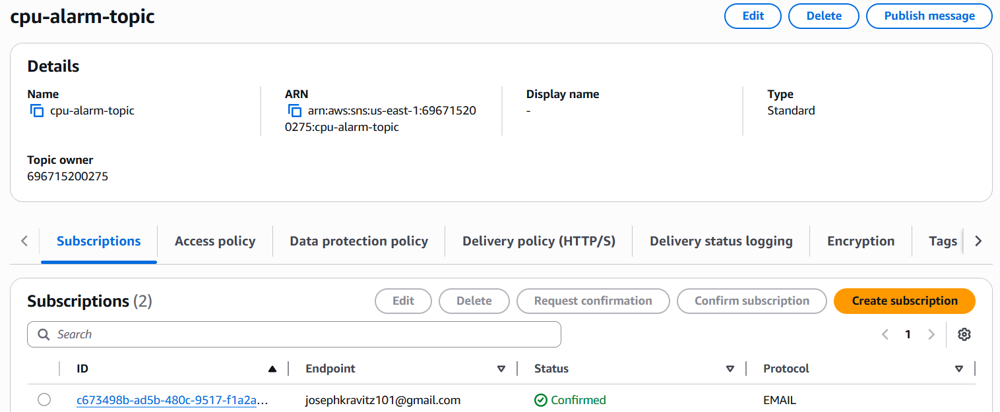

# Terraform CloudWatch Monitoring & Alerting (with VPC)

This project demonstrates **Infrastructure as Code (IaC)** best practices by provisioning a complete networking foundation and monitoring setup using Terraform.

## Project Overview
- Created a custom **VPC** with public subnet and Internet Gateway
- Deployed a t3.micro EC2 instance in the VPC
- Configured Security Groups with proper ingress/egress rules
- Set up **CloudWatch** CPU utilization monitoring and alerting
- Configured **SNS** for email notifications when CPU > 70%

## Technologies Used
- **Terraform** (Infrastructure as Code)
- AWS VPC, Subnets, Internet Gateway, Route Tables
- AWS EC2
- AWS Security Groups
- AWS CloudWatch (Metrics & # Terraform CloudWatch Monitoring & Alerting (with VPC)

This project demonstrates **Infrastructure as Code (IaC)** by provisioning a complete networking foundation (VPC + Subnet) and setting up CloudWatch monitoring & alerting using Terraform.

## Project Overview
- Created a custom **VPC** with public subnet and Internet Gateway
- Deployed a t3.micro EC2 instance
- Configured Security Groups
- Set up **CloudWatch** CPU monitoring with SNS email alerts

## Technologies Used
- Terraform (Infrastructure as Code)
- AWS VPC, Subnets, Internet Gateway
- AWS EC2, Security Groups
- AWS CloudWatch + SNS

## Architecture


## Screenshots

### 1. Project Structure


### 2. Terraform Apply


### 3. VPC & Networking


### 4. EC2 Instance


### 5. Security Group Rules


### 6. CloudWatch Alarm


### 7. CloudWatch Alarm Graph


### 8. SNS Topic & Email Subscription


## View Terraform Code
- [terraform.tf](terraform.tf) — Terraform version and provider configuration
- [main.tf](main.tf) — Main resources (VPC, EC2, Security Group, CloudWatch, SNS)

## How to Deploy

```powershell
terraform init
terraform plan
terraform apply
- AWS SNS (Simple Notification Service)

