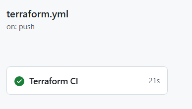

# Terraform CloudWatch Monitoring & Alerting (with VPC)

## 🚀 Project Overview
This project demonstrates modern **Infrastructure as Code (IaC)** principles. It provisions a hardened VPC, deploys a secure EC2 instance, and implements automated monitoring and alerting.

**Key Achievement:** This project features a full **CI/CD pipeline using GitHub Actions** to validate and plan all infrastructure changes automatically, ensuring high code quality and security.

## 🛠 Technology Stack
- **Infrastructure:** AWS VPC, Subnets, EC2 (t3.micro), Security Groups
- **Automation/IaC:** Terraform
- **Monitoring:** AWS CloudWatch (Metrics & Alarms)
- **Notifications:** AWS SNS (Simple Notification Service)
- **CI/CD:** GitHub Actions (Automated Linting, Validation, and Planning)

## 🏗 Architecture

## ⚙️ Automated CI/CD Pipeline
Every `push` to `main` triggers a GitHub Actions workflow that automatically runs:
1. `terraform fmt` - Ensures consistent style.
2. `terraform validate` - Catches syntax errors.
3. `terraform plan` - Confirms the infrastructure plan is valid.

## 📸 Project Highlights
## Screenshots

### 1. Project Structure

### 2. Terraform Apply

### 3. VPC & Networking

### 4. EC2 Instance

### 5. Security Group Rules

### 6. CloudWatch Alarm

### 7. CloudWatch Alarm Graph

### 8. SNS Topic & Email Subscription

### 9. CI/CD Pipeline Verification
*The following image confirms a successful CI/CD pipeline run, validating the Terraform configuration, style, and planning phases.*

💡 Lessons Learned
Automating this infrastructure provided key insights into professional DevOps workflows:

Pipeline Directory Logic: GitHub Actions runs from the repository root by default. I resolved pathing issues by configuring defaults.run.working-directory in my workflow, ensuring Terraform commands executed within the correct project subdirectory.

Secure Variable Injection: To avoid hardcoding sensitive data, I utilized GitHub Secrets combined with TF_VAR_ environment variables. This securely decoupled my configuration from the codebase while allowing Terraform to access necessary values at runtime.

CI Enforcement: By integrating terraform fmt and validate into the pipeline, I moved from manual verification to automated "quality gates." This ensures that only properly formatted, syntactically correct code reaches the planning stage.

Operational Risk Management: I automated validation and planning but kept the terraform apply step manual. This balances efficiency with safety, ensuring that critical infrastructure changes require human review before reaching the cloud.

## 🚀 How to Deploy
1. Clone this repository.
2. Configure AWS credentials in GitHub Secrets.
3. Push to `main` to trigger the CI/CD pipeline.