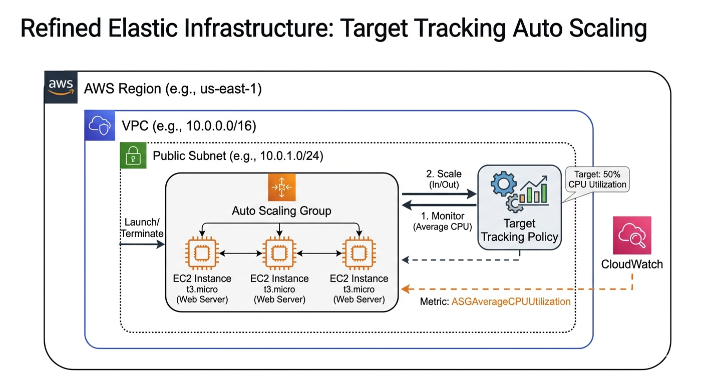
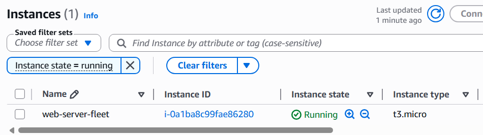
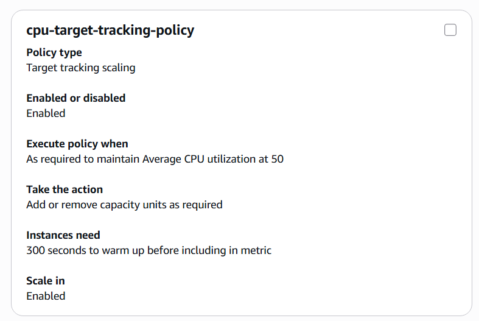
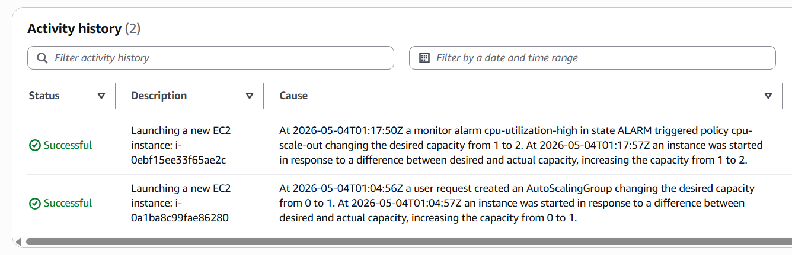
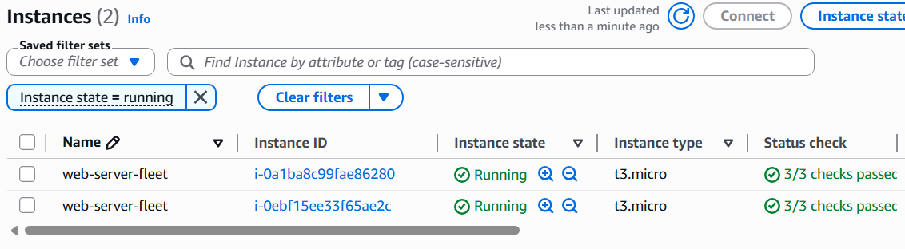

# Terraform Elastic AWS Infrastructure

## 🚀 Project Overview
This project demonstrates modern **Infrastructure as Code (IaC)** principles. It provisions a hardened VPC and a highly available, elastic web infrastructure using an **Auto Scaling Group (ASG)** managed by **Target Tracking Policies**.

**Key Achievement:** This project features a robust **CI/CD pipeline using GitHub Actions** to validate and plan all infrastructure changes automatically, ensuring high code quality and security.

---

## 🛠 Technology Stack
- **Infrastructure:** AWS VPC, Subnets, EC2 (t3.micro), Auto Scaling Groups (ASG)
- **Automation/IaC:** Terraform
- **Observability:** AWS CloudWatch (Metrics & Target Tracking)
- **CI/CD:** GitHub Actions (Automated Linting, Validation, and Planning)

---

## 🏗 Architecture

---

## ⚙️ Automated CI/CD Pipeline
Every `push` to `main` triggers a GitHub Actions workflow:
1. `terraform fmt` - Ensures consistent style.
2. `terraform validate` - Catches syntax errors.
3. `terraform plan` - Confirms the infrastructure plan is valid.

---

## 💡 Operational Highlights
* **Elasticity & Cost Optimization:** Implemented **Target Tracking Scaling Policies** to maintain an average CPU utilization of 50%. This ensures the fleet dynamically scales out during traffic spikes and scales in during low-demand periods, optimizing cloud spend.
* **Infrastructure as Code (IaC) Lifecycle:** By utilizing Target Tracking, the monitoring lifecycle is synchronized with the infrastructure lifecycle, eliminating "orphan" alarms and reducing configuration clutter.
* **Pipeline Directory Logic:** Configured `defaults.run.working-directory` in workflows to ensure CI/CD tasks execute within the correct subdirectories, preventing common pathing errors.
* **Operational Risk Management:** Automated validation ensures quality, while `terraform apply` is kept manual to allow for human review of critical infrastructure changes.

---

## 📸 Project Highlights
## Screenshots

### 1. Project Structure

### 2. CI/CD Pipeline Verification

### 3. Initial instance

### 4. Target Tracking Policy configuration

### 5. ASG scaling history

### 6. Current instance state

---

## 🚀 How to Deploy
1. Clone this repository.
2. Configure `AWS_ACCESS_KEY_ID` and `AWS_SECRET_ACCESS_KEY` in GitHub Secrets.
3. Push to `main` to trigger the CI/CD pipeline.

---

## 💡 Why I Built This
I built this to master the intersection of **Infrastructure as Code** and **cloud elasticity**. My goal was to create a production-ready environment that prioritizes automated scaling and cost-efficiency, moving beyond static deployments to resilient, self-managing infrastructure.