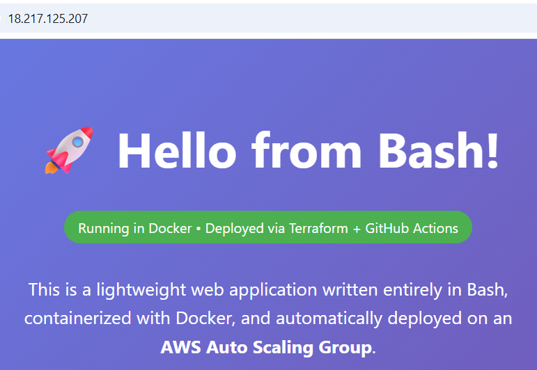

# Terraform Elastic AWS Infrastructure

## 🚀 Project Overview

This project provisions a hardened, high-availability AWS environment using **Infrastructure as Code (IaC)**. It features an elastic web tier managed by an **Auto Scaling Group (ASG)** with **Target Tracking Policies**, all deployed via a secure, **keyless CI/CD pipeline**.

**Key Achievement:** Migrated from local state and static credentials to a professional **S3 Remote Backend** with **DynamoDB State Locking** and **GitHub Actions OIDC authentication**.

### ✨ Major Update: Dockerized Bash Web Application
- Added a **real running application** on top of the infrastructure
- Lightweight web server written entirely in **Bash** (using netcat)
- Fully containerized with Docker
- Automatic build & push via GitHub Actions on every commit
- EC2 instances automatically pull and run the latest container via `user_data` bootstrap script



*Screenshot of the live Bash web application running on the Auto Scaling Group.*

---

## 🏗 Unified CI/CD (Plan Only) & Secure Infrastructure Architecture

---

## 🏗 Unified CI/CD (Plan Only) & Secure Infrastructure Architecture


### Architecture Highlights:

#### 1. Professional CI/CD Flow (Plan vs. Apply)
- **Automatic Planning:** Every `push` to `main` triggers a GitHub Actions workflow that validates the code, exchanges OIDC tokens, and runs a `terraform plan`.
- **Manual Deployment:** `terraform apply` is intentionally manual for safety and control.

#### 2. "State-of-the-Art" State Management
- **Remote State (S3)**
- **State Locking (DynamoDB)**

#### 3. Keyless Security (OIDC)
- Zero static secrets in GitHub.

---

## 🛠 Technology Stack

- **Cloud Provider:** AWS (VPC, EC2, ASG, S3, DynamoDB, IAM, CloudWatch, SNS)
- **IaC:** Terraform (Modularized)
- **CI/CD:** GitHub Actions
- **Containerization:** Docker + Docker Hub
- **Application:** Bash + netcat
- **Security:** OIDC Identity Federation
- **Observability:** CloudWatch Metrics & Alarms

---

## ⚙️ Automated CI/CD Pipeline

Every `push` to `main` triggers a GitHub Actions workflow:

1. **Terraform Plan** – Format, Init, Validate, and Plan
2. **Docker Build & Push** – Builds and pushes the Bash web app image to Docker Hub

---

## 💡 Operational Highlights
- **Elasticity:** Target Tracking Scaling Policies (maintains ~50% CPU)
- **Proactive Monitoring:** CloudWatch alarm + SNS notifications when CPU > 70%
- **Real Application Layer:** Dockerized Bash web server running on the ASG
- **Modular & Clean Code**

---

### 🛡️ Local Pre-Flight Validation Framework
To optimize developer velocity and ensure zero-fault commits, the repository includes a native Bash utility script located at `scripts/validate-infra.sh`. 

Instead of waiting for remote CI/CD runners to spin up and fail on minor syntax errors or formatting slips, developers can execute this local "sanity check" inside their environment before code ever leaves their machine. 

The utility automates:
1. **Dependency Verification:** Dynamically checks the system's `$PATH` to ensure the correct version of the Terraform CLI is active.
2. **Deterministic Code Styling:** Executes `terraform fmt -check -recursive` to strictly validate configuration file alignment against HashiCorp layout standards.
3. **Compilation & Grammar Scan:** Runs a swift initialization (`-backend=false`) and runs `terraform validate` to catch references to missing variables, block issues, or typos.
4. **Credential Audit (Secret Leak Protection):** Uses a recursive regex scan to audit code patterns for raw `access_key` or `secret_key` declarations, acting as an extra layer of defense to preserve our keyless OIDC posture.

**To run the validation locally:**
```bash
chmod +x scripts/validate-infra.sh
./scripts/validate-infra.sh
```

---

## 📸 Project Highlights
### 1. Keyless Authentication (OIDC)


*IAM Role configured with a Trust Relationship to GitHub Actions.*

### 2. Remote State in S3


*Proof of S3 backend showing the stored .tfstate file.*

### 3. Successful CI/CD Execution


*The pipeline now successfully performs:*
- Terraform Format, Init, Validate, and Plan
- Docker Build & Push of the Bash web application to Docker Hub
- Secure OIDC authentication with AWS

This demonstrates a complete **Infrastructure as Code + Application Deployment** pipeline.

### 4. Auto Scaling in Action


*CloudWatch-driven scaling activity maintaining fleet health.*

### 5. CloudWatch High CPU Alarm


*CloudWatch alarm 'cpu-utilization-high' configured to notify via SNS when average CPU utilization in the Auto Scaling Group exceeds 70%.*

---

## 🚀 How to Deploy
1.  **Bootstrap the Backend:**
    * Navigate to the `/bootstrap` folder and run `terraform apply`.
    * This creates the S3 Bucket, DynamoDB Table, and OIDC IAM Role.
2.  **Configure GitHub Secrets:**
    * Add `ALLOWED_IP` (e.g., `1.2.3.4/32`) and `ALERT_EMAIL` to your repository secrets.
3.  **Update Workflow:**
    * Ensure the `role-to-assume` in `.github/workflows/terraform.yml` matches the ARN provided by the bootstrap output.
4.  **Push to Main:**
    * Push your feature branch or open a Pull Request to `main`. GitHub Actions will automatically take over, run formatting audits, syntactical checks, and output a detailed `terraform plan` to preview the pending AWS architectural changes.

---

## 💡 Why I Built This
This project was built to master the transition from manual cloud configuration to **Production DevOps**. By implementing OIDC and Remote State, I solved the two biggest challenges in team-based infrastructure: **Security** and **Concurrency**. It demonstrates my ability to build resilient, self-managing, and secure cloud environments.