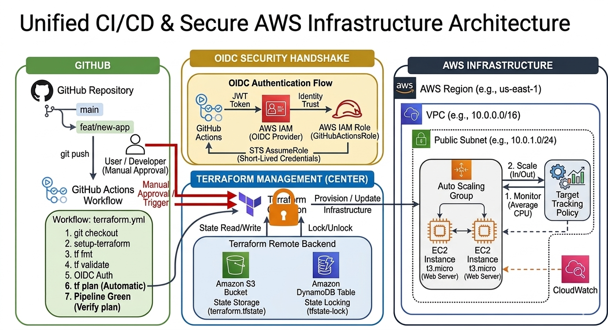
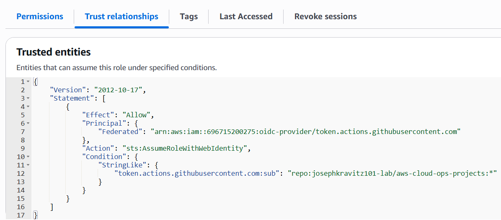
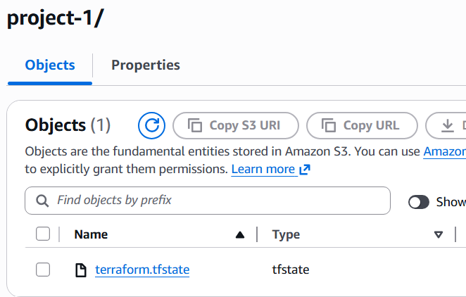
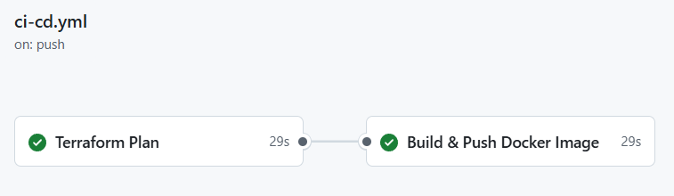
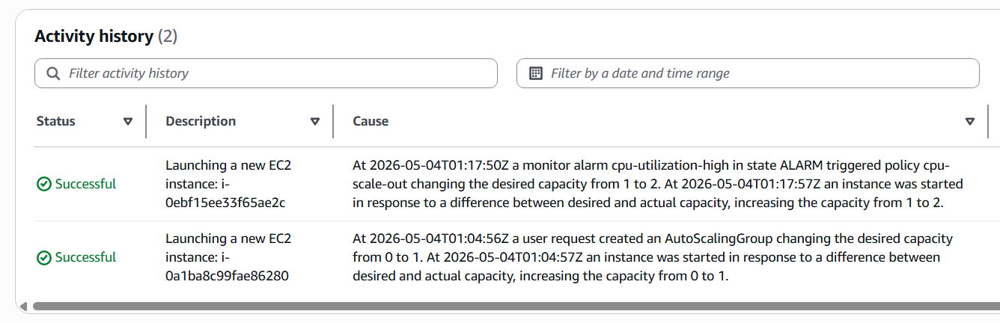
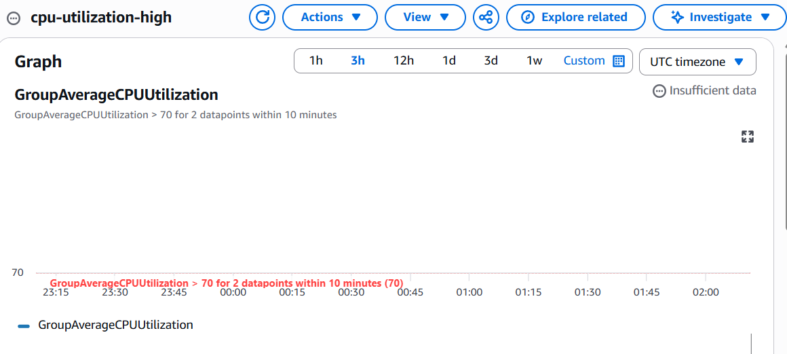

# Terraform Elastic AWS Infrastructure

## 🚀 Project Overview
This project provisions a hardened, high-availability AWS environment using **Infrastructure as Code (IaC)**. It features an elastic web tier managed by an **Auto Scaling Group (ASG)** with **Target Tracking Policies**, all deployed via a secure, **keyless CI/CD pipeline**.

**Key Achievement:** Migrated from local state and static credentials to a professional **S3 Remote Backend** with **DynamoDB State Locking** and **GitHub Actions OIDC authentication**.

---

## 🏗 Unified CI/CD (Plan Only) & Secure Infrastructure Architecture

This diagram illustrates the complete, integrated ecosystem of this project, combining a hardened AWS VPC, an elastic compute tier, and a secure, keyless validation pipeline.

### Architecture Highlights:

#### 1. Professional CI/CD Flow (Plan vs. Apply)
* **Automatic Planning:** Every `push` to `main` triggers a GitHub Actions workflow that automatically validates the code, exchanges OIDC tokens, and runs a `terraform plan`. This provides immediate feedback and a preview of changes.
* **Manual Deployment:** To prevent accidental infrastructure updates, the `terraform apply` step is *intentionally* not automated. It requires manual approval and a controlled execution by the developer, matching the flow used in many professional environments.

#### 2. "State-of-the-Art" State Management
* **Remote State (S3):** The project migrates from local state to a professional **Amazon S3 Backend**. This provides a central "Single Source of Truth," crucial for team collaboration and disaster recovery.
* **State Locking (DynamoDB):** Uses a **DynamoDB Table** for state locking, preventing concurrent CI/CD runs from corrupting the state file—a requirement for any production deployment.

#### 3. Keyless Security (OIDC)
* **Zero Static Secrets:** By eliminating `AWS_ACCESS_KEY_ID` from GitHub, we have removed the risk of credential leakage, implementing the gold standard for CI/CD security.

---

## 🛠 Technology Stack
- **Cloud Provider:** AWS (VPC, EC2, ASG, S3, DynamoDB, IAM, CloudWatch, SNS)
- **IaC:** Terraform (Modularized)
- **CI/CD:** GitHub Actions
- **Security:** OIDC Identity Federation
- **Observability:** CloudWatch Metrics & Alarms (including high CPU utilization alerts)

---

## ⚙️ Automated CI/CD Pipeline
Every `push` to `main` triggers a GitHub Actions workflow that executes in a clean, ephemeral environment:
1.  **Format & Validate:** Runs `terraform fmt` and `terraform validate` to ensure code quality.
2.  **OIDC Handshake:** The runner securely authenticates with AWS without stored passwords.
3.  **Automated Planning:** Generates a `terraform plan` to preview changes before they happen.
4.  **Controlled Deployment:** Infrastructure is updated automatically upon merge to `main`.

---

## 💡 Operational Highlights
* **Elasticity:** Implemented **Target Tracking Scaling Policies** to maintain average CPU utilization at 50%, ensuring the fleet scales out for traffic and scales in for cost savings.
* **Proactive Monitoring:** Added **CloudWatch Metric Alarm** (`cpu-utilization-high`) that triggers when **GroupAverageCPUUtilization** exceeds **70%** for 2 evaluation periods (10 minutes). The alarm sends notifications via **SNS** topic.
* **Modular Design:** Code is split into logical modules (Network, Compute) for reusability and easier maintenance.
* **Directory Logic:** Utilizes `working-directory` configurations in CI/CD to handle multi-folder project structures effectively.

---

## 📸 Project Highlights
### 1. Keyless Authentication (OIDC)

*IAM Role configured with a Trust Relationship to GitHub Actions.*

### 2. Remote State in S3

*Proof of S3 backend showing the stored .tfstate file.*

### 3. Successful CI/CD Execution

*The green pipeline showing successful Init, Plan, and OIDC Authentication.*

### 4. Auto Scaling in Action

*CloudWatch-driven scaling activity maintaining fleet health.*

### 5. CloudWatch High CPU Alarm

*CloudWatch alarm 'cpu-utilization-high' configured to notify via SNS when average CPU utilization in the Auto Scaling Group exceeds 70%.*

---

## 🚀 How to Deploy
1.  **Bootstrap the Backend:**
    * Navigate to the `/bootstrap` folder and run `terraform apply`.
    * This creates the S3 Bucket, DynamoDB Table, and OIDC IAM Role.
2.  **Configure GitHub Secrets:**
    * Add `ALLOWED_IP` (e.g., `1.2.3.4/32`) and `ALERT_EMAIL` to your repository secrets.
3.  **Update Workflow:**
    * Ensure the `role-to-assume` in `.github/workflows/terraform.yml` matches the ARN provided by the bootstrap output.
4.  **Push to Main:**
    * GitHub Actions will take over, validate the code, and deploy the infrastructure.

---

## 💡 Why I Built This
This project was built to master the transition from manual cloud configuration to **Production DevOps**. By implementing OIDC and Remote State, I solved the two biggest challenges in team-based infrastructure: **Security** and **Concurrency**. It demonstrates my ability to build resilient, self-managing, and secure cloud environments.