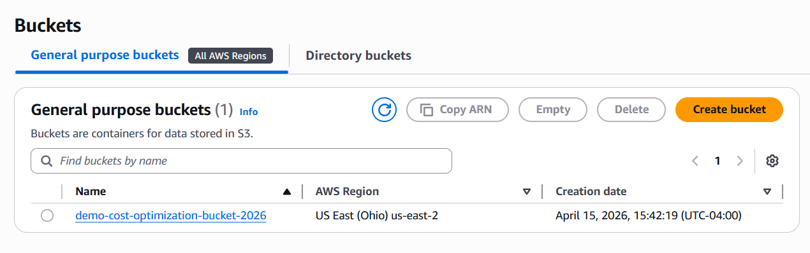
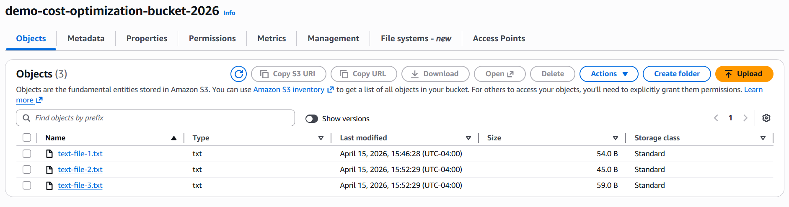
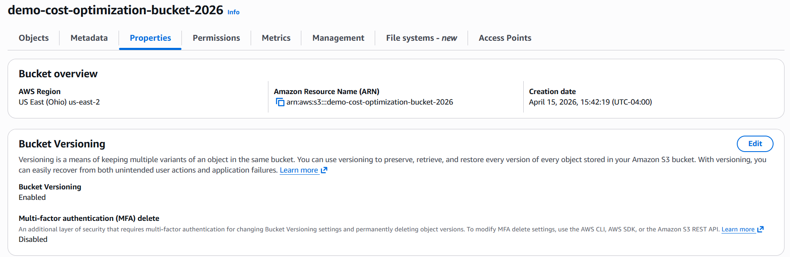
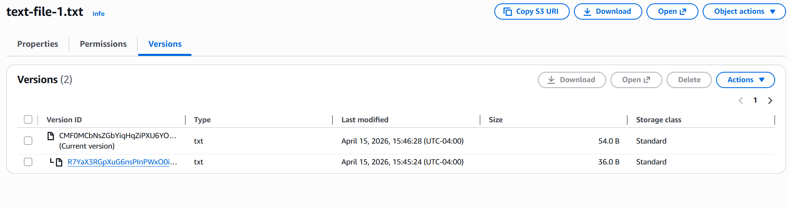
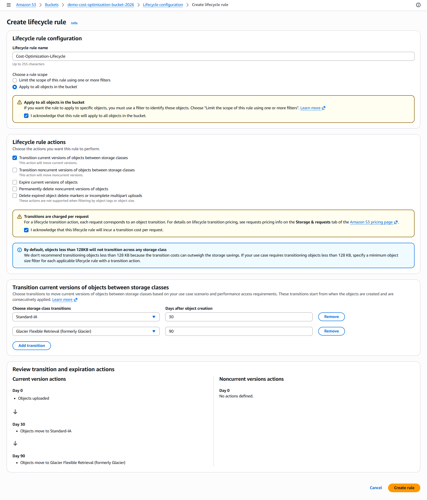
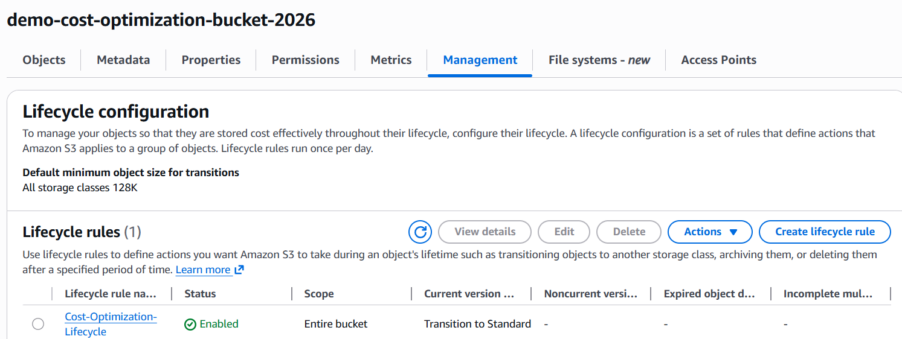
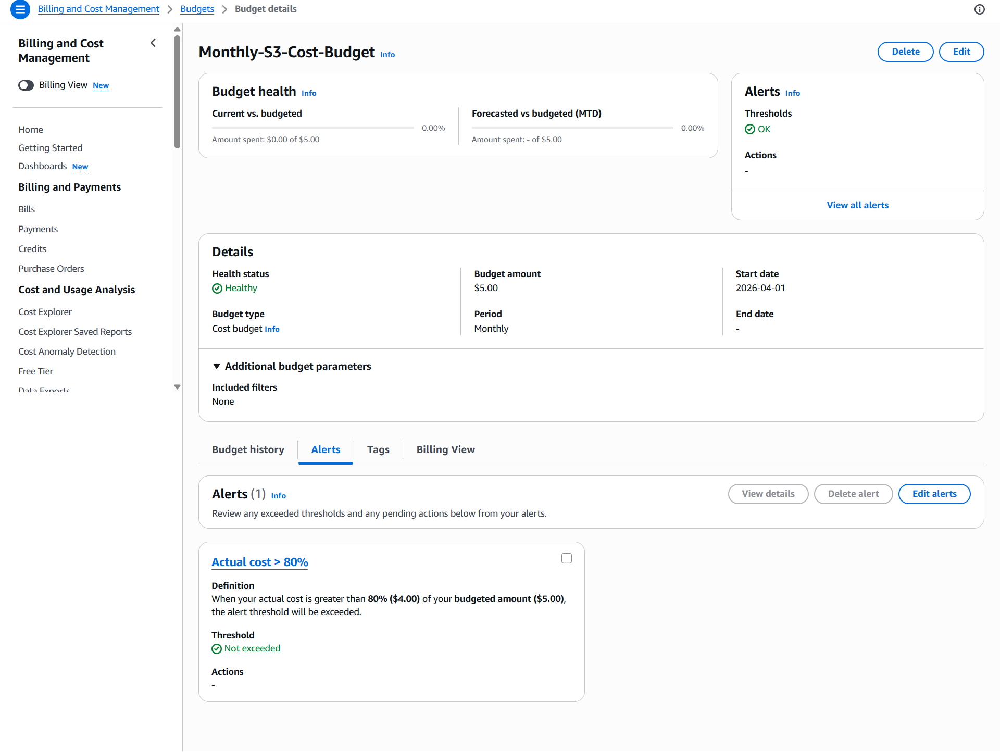

# Project 2: S3 Cost Optimization with Lifecycle Rules & Budgets

## Project Overview
This project demonstrates cost optimization techniques in Amazon S3 by using lifecycle rules to automatically move objects to cheaper storage classes and setting up AWS Budgets for spending monitoring.

These practices are essential in Cloud Operations to control costs while maintaining data availability and reliability.

## Architecture / Approach
- S3 bucket with versioning enabled for data protection
- Lifecycle rule to transition objects to lower-cost storage
- AWS Budgets with alerts to monitor spending

## Technologies Used
- Amazon S3 (Standard + Intelligent-Tiering / Standard-IA)
- S3 Bucket Versioning
- S3 Lifecycle Rules
- AWS Budgets

## What I Built
- Created an S3 bucket and uploaded test files
- Enabled bucket versioning to protect against accidental deletion/overwrites
- Configured a lifecycle rule to transition current versions to S3 Standard-IA after 30 days
- Configured two lifecycle rules:
  - Transition current versions to S3 Standard-IA after 30 days
  - Transition noncurrent versions to S3 Glacier after 90 days
- Set up an AWS Budget with an 80% alert threshold to monitor costs

## Screenshots

**1. S3 Bucket Created**

**2. Files Uploaded to Bucket**

**3. Bucket Versioning Enabled**

**4. Object Versions Visible**

**5. Lifecycle Rule Configuration**

**6. Lifecycle Rule Listed**

**7. AWS Budgets Dashboard**

## Key Learnings
- How to use S3 Lifecycle rules to automatically reduce storage costs by transitioning objects to cheaper classes
- Importance of bucket versioning for data protection and recoverability
- Setting up proactive cost monitoring with AWS Budgets and alert thresholds
- Balancing cost savings with data availability in a production environment

## How This Relates to Cloud Ops
In Cloud Operations, managing storage costs and implementing automated optimization rules is a daily responsibility. This project shows practical techniques to control AWS spending while maintaining reliability.

---

**Made as part of my journey toward a Cloud Operations Engineer role**  
AWS Certified Cloud Practitioner (CLF-C02) | April 2026