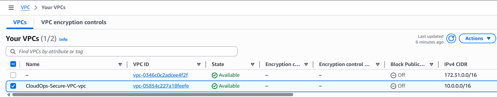
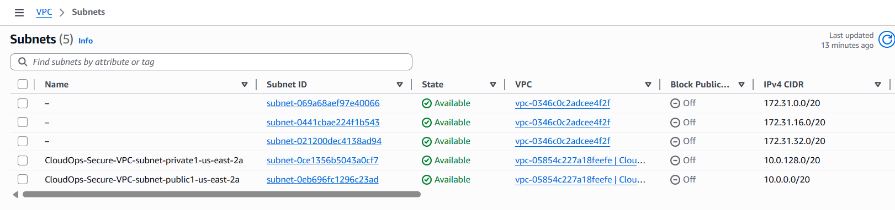
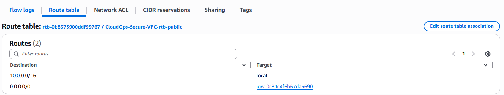
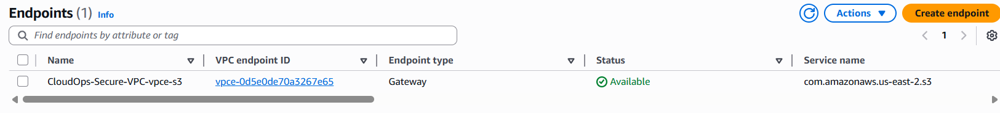
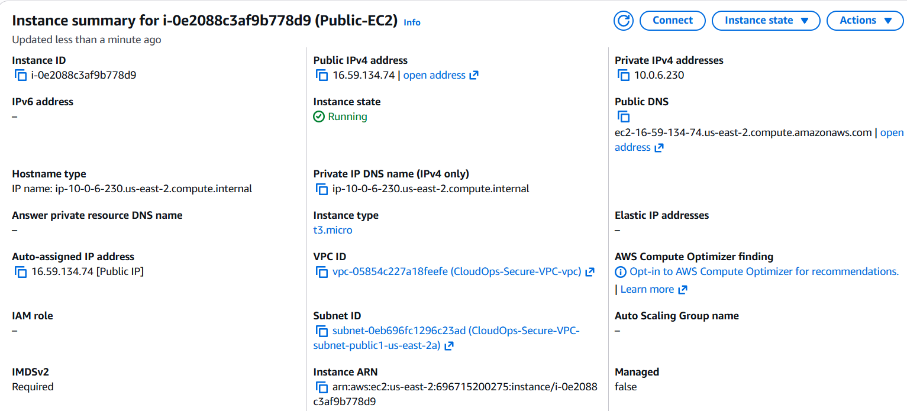
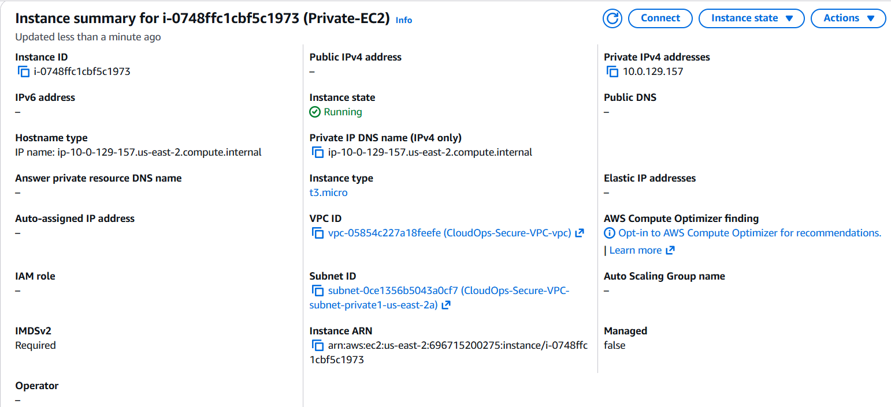
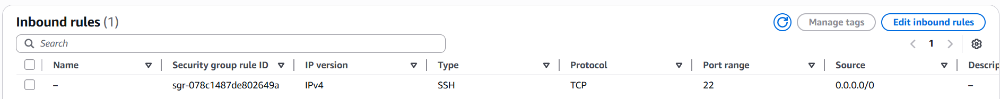

# Project 3: Secure VPC Architecture

## Project Overview
This project demonstrates how to build a secure, production-like network environment in AWS using a custom VPC with public and private subnets, proper routing, and security groups.

The goal was to show network isolation, controlled internet access, and secure resource placement — core skills for Cloud Operations roles.

## Technologies Used
- Amazon VPC
- Subnets (Public & Private)
- Internet Gateway
- Route Tables
- Security Groups
- S3 Gateway VPC Endpoint
- Amazon EC2

## What I Built
- Created a custom VPC with 1 public subnet and multiple private subnets
- Enabled an S3 Gateway VPC Endpoint for private access to S3
- Launched an EC2 instance in the public subnet (with public IP)
- Launched an EC2 instance in the private subnet (no public IP)
- Configured security groups to control inbound traffic

## Screenshots

### 1. VPC List

### 2. Subnets List (5 subnets)

### 3. Public Route Table

### 4. S3 Gateway VPC Endpoint

### 5. Public EC2 Instance Running (with Public IP)

### 6. Private EC2 Instance (no Public IP)

### 7. Security Group Rules for Public EC2

## Key Learnings
- How to create and configure a custom VPC with public and private subnets
- The importance of route tables for controlling traffic flow
- Difference between public and private subnets (public IP assignment)
- Using S3 Gateway VPC Endpoint for secure, private access to S3
- Applying security groups to control inbound traffic

## Notes
- AWS automatically provisioned 5 subnets when creating the VPC with the S3 Gateway endpoint enabled.
- The public EC2 has both a private IP (for VPC communication) and a public IP (for internet access), while the private EC2 has only a private IP.

## How This Relates to Cloud Ops
In Cloud Operations, designing and maintaining secure network architectures is a daily responsibility. This project demonstrates fundamental concepts used to isolate resources, control traffic, and securely connect to AWS services.

---

**Made as part of my journey toward a Cloud Operations Engineer role**  
AWS Certified Cloud Practitioner (CLF-C02) | April 2026